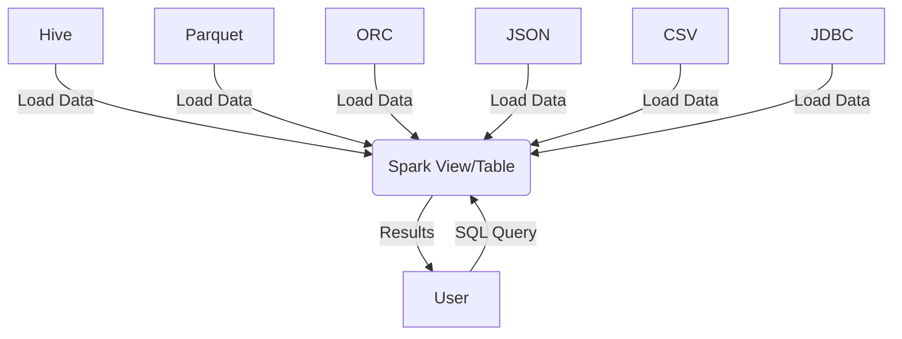

# SparkSQL API Tutorial
<!-- toc -->
  * [Introduction](#introduction)
  * [Architecture](#architecture)
  * [Setting Up via Docker](#setting-up-via-docker)
  * [Spark Session & Configurations](#spark-session-&-configurations)
    + [Creating a Spark Session](#creating-a-spark-session)
    + [Configurations](#configurations)
  * [Datasets & DataFrames](#datasets-&-dataframes)
    + [Dataframe API](#dataframe-api)
    + [DataFrame Operations](#dataframe-operations)
    + [Creating Views](#creating-views)
  * [SQL](#sql)
  * [User Defined Functions](#user-defined-functions)

<!-- tocstop -->

---

## Introduction

- Spark SQL is a module that is built on Apache Spark, and SparkSQL enables seamless structured and semi-structured data analysis.
- It supports Dataframes and Datasets, and enables querying capabilities within Spark programs via a Dataframe API or via SQL.
- Spark SQL integrates with various programming languages, data sources, and other Big Data APIs.
- This tutorial focuses on showcasing the use of SparkSQL in Python via pyspark through various examples.
- More information on Spark SQL can be found [here](https://spark.apache.org/sql/).
- The sparkSQL.API.md will show case how to implement the functionalties of SparkSQL, including Spark Session, DataFrame API, and SQL function using a small dataset.

---

## Architecture

While Spark SQL has a majority of the same functionalities as traditional SQL, its extension of SQL and integration with Apache Spark enables analysis of large dispersed datasets. It works well for large-scale distributed computing across a cluster, and can be horizontally scaled. It can be used with Spark's native data structure RDDs and even external sources like Hive tables, which can be integrated via ETL pipelines. Spark SQL's configurations can further enhance query performance especially for large-scale computing.

**Diagram**



## Setting Up via Docker

In order to begin querying with Spark SQL via pyspark, we will need to ensure we have all the required dependencies:
- 'Apache Spark'
- 'Apache Hadoop'
- 'Java'
- 'Python'
- 'Jupyter'

These dependencies are already installed via this Docker container. To run the container and open in Jupyter, follow the steps below:

 ```bash
 > ./docker_build.sh
 > ./docker_bash.sh
 > /data/run_jupyter.sh
 ```

---

## Spark Session & Configurations

### Creating a Spark Session

To create a simle Spark Session, follow the steps below. Any [configurations](https://spark.apache.org/docs/3.5.4/sql-performance-tuning.html) can be added using '.config(...) \'.

```bash
spark = SparkSession.builder \
    .appName("API Example") \
    .getOrCreate()
```

### Configurations

There are various Spark SQL configurations that can be set when creating a Spark Session to allow for performance improvement. These settings can be tuned with respect to the partitions and data files created within an application that ingests data, performs a sequence of queries, and outputs the data. 

**What is data partitioning?**
Partitions in a data source play a critical role during the large-scale cluster computing. Setting partition column(s) helps reduce data shuffle and helps Spark distribute the data across the cluster during large-scale computing.

However, there may be cases when certain column values have more associated rows in a table than others, leading to data skew across partitions and data files. When executed on massive data sizes across a cluster, adjusting these settings and configurations can improve runtime, reduce data loss, improve fault tolerance, and much more.

This tutorial uses a small sample dataset that does not necessarily require these configurations. You can learn more about the different configurations [here](https://spark.apache.org/docs/3.5.4/sql-performance-tuning.html).

---

## Datasets & DataFrame 

When Spark SQL is run through another programming language (Python, Java, Scala, etc), the results are returned either as a Dataset or DataFrame.

1. Dataset API - Is availabile in Scala and Java.
2. DataFrame API - Is available in Scala, Java, Python and R. It is a dataset which is organized into named columns.

More information can be found [here](https://spark.apache.org/docs/latest/sql-programming-guide.html#datasets-and-dataframes).

This tutorial uses the 'DataFrame API' due to its integration with Python.

### DataFrame API

A DataFrame can be created by loading data from an existing RDD, a Hive table, data files (JSON, CSV, TXT, etc), or by inserting data yourself.
This can be done as follows:
1. **Load from a JSON file**
```bash
df = spark.read.json("path/to/file/filename.json")
```
2. **Create via inserting**
```bash
df = spark.createDataFrame(
    [
        ("name1", age1),
        ("name2", age2)
    ],
    ["name", "age"],
)
```

More information about the DataFrame API can be found [here](https://spark.apache.org/docs/latest/api/python/reference/pyspark.sql/api/pyspark.sql.DataFrame.html).

### DataFrame Operations

DataFrame operations can be used to perform various analyses that are similar to those achieved by SQL SELECT statements. Some possible operations include:

1. Displaying specific column(s)
2. Displaying rows filtered on some condition
3. Adding columns
4. Peforming group by aggregate operations
    - These functions can be imported via 'pyspark.sql.functions'.

Examples can be found [here](https://spark.apache.org/docs/latest/sql-getting-started.html#untyped-dataset-operations-aka-dataframe-operations).
    
### Creating Views

Generally, in traditional SQL, queries are written to SELECT from specific views or tables. The views can be created via the DataFrame API.

**Views**
1. Global View: 'createOrReplaceGlobalTempView(name)'
    - Temporary view that can be accessed across all sesssions, and persists until the Spark application terminates.
2. Temporary View: 'createOrReplaceTempView(name)'
    - It no longer exists once the Spark session that created it terminates.

---

## SQL

Via the 'sql' function on the Spark Session, we can programmatically run SQL queries against the views/tables created using the DataFrame API, and return the results as a DataFrame. In this way, we can easily write common query statements:
1. CREATE TABLE
2. INSERT INTO TABLE
3. SELECT ... FROM ...

We can write even more complex queries by including filters, window functions, additional statements, embedded queries, CASE expression, WITH clause, joins, and much more. 

```bash
> df.write.saveAsTable("table_name")
> spark.sql("select * from table_name").show()
```
We will explore more complex queries in 'sparkSQL.API.ipynb'. A brief example can be found [here](https://spark.apache.org/examples.html).

Spark SQL supports numerous scalar and aggregate functions that can be incorporated in queries. A complete list of them can be found [here](https://spark.apache.org/docs/3.5.4/sql-ref-functions.html#udfs-user-defined-functions).

Examples include
1. Array functions
2. Window functions
3. Date and Timestamp functions
4. User Defined Functions

---

## User Defined Functions

While the DataFrame API supports functions like 'avg', 'when', and 'col', we can also create user defined functions which can act on single or multiple rows. These are created when the built-in functions do not meet user requirements. Creating a UDF is a three step process:

1. Define the function
2. Register the function with Spark
3. Call the registered function

Example of UDF:

```bash
> @udf(returnType=____)
> def func_name(argument):
    #Code block
    return ___

> spark.udf.register("func_name", func_name)

> spark.sql("SELECT column1, func_name(column2) FROM table_name").show()
```


