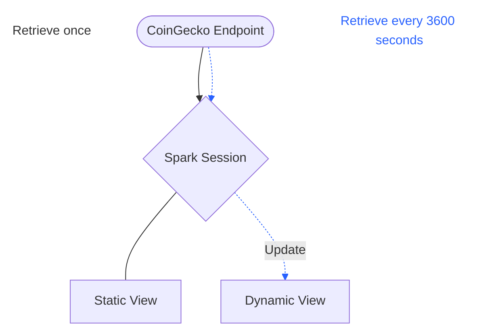

# SparkSQL Example Tutorial

<!-- toc -->

  * [Introduction](#introduction)
  * [Data](#data)
      * [API Endpoint](#api-endpoint)
      * [Data Loading](#data-loading)
          * [BitcoinDataLoader](#bitcoindataloader)
          * [Views](#views)
  * [Analyses & Visualizations](#analyses-&-visualizations)
      * [Monthly Price Over the Past Year](#monthly-price-over-the-past-year)
      * [Hourly Price Over the Past 90 Days](#daily-price-over-the-past-90-days)
      * [Spikes & Drops In Prices](#spikes-and-drops-in-prices)
      * [Price Prediction & Extrapolation](#price-prediction-&-extrapolation)


<!-- tocstop -->

---

## Introduction

Say we want to find the price of the Bitcoin (BTC) cryptocurrency, but we don't want just the price, we also want to understand the trend in how the price has changed. How can we do this? This is where SparkSQL comes in. SparkSQL will help enable real-time data analysis using historical and current Bitcoin price information.

In this tutorial, we will:

1. Load real-time data into Spark using Dataframe operations.
2. Use SparkSQL to find descriptive statistics and identify patterns and abnormalities in price changes.
3. Visualize these trends to facilitate understanding.

---

## Data

This tutorial fetches the real-time data from [CoinGecko](https://docs.coingecko.com/v3.0.1/reference/introduction), which contains multiple endpoints with varying degrees of information regarding cryptocurrency pricing. This tutorial only looks at Bitcoin (BTC) in USD currency. 

### API Endpoint

Specifcally, this tutorial uses the '/coins/{id}/market_chart/range' endpoint. More details on this endpoint can be found [here](https://docs.coingecko.com/v3.0.1/reference/coins-id-market-chart-range).

This endpoint contains pricing data at various granulity levels:

1. 90 days or more at the daily level
2. 2-90 days at the hourly level
3. 1 day at the 5-minute level

For this example, we will focus on hourly data for the past 3 months and daily data for the past 1 year to perform the time-series analysis.


### Data Loading

The file 'sparkSQL_utils.py' contains the class 'BitcoinDataLoader' which contains functions to statically and dynamically create views containing the specified duration and interval of data.

#### BitcoinDataLoader

**'load_data'**
This function populates the view with Bitcoin prices in a given currency for a given past total_days; it is used directly to populate the daily data view and indirectly to populate the hourly data view. 

**'fetch_data_range'**
This function returns price data using a given time range and currency of Bitcoin. The time interval of data retrieved is based on the total_days and the API endpoint's granulity levels.

It is not called directly in the example notebook, but rather indirectly in the 'load_data' function.

**'start_real_time_update'**
This function fetches and loads existing Bitcoin price data within specified days and starts real time updates at every hour. The 
function will identify if there is new hourly data to add, and updates the existing view. This function is directly called to create the hourly data view.

**'stop_real_time_update'**
This function can be used to stop real time updates in the notebook, if desired. 

#### Views
Each view contains three columns:
- Price - in USD
- Timestamp - UNIX timestamp
- Price_Date - Timestamp column converted to respective format

1. **Static Data**
    - This data is loaded for the past year at the daily level.
    - The past year is defined as the past 365 days from the date that the notebook is run.
  ```python
  # Sample daily view structure.
  +-----------------+-----------+----------+
  |            price|  timestamp|price_date|
  +-----------------+-----------+----------+
  |93605.45230873208|1.7454528E9|2025-04-24|
  +-----------------+-----------+----------+
  ```
2. **Dynamic Data**
    - This data is loaded for the past 3 months at the hourly level.
    - The past 3 months are defined as the past 90 days from the date that the notebook is run.
    - Data is dynamically updated with hourly level data every hour until the stop function is called. 
    - Dynamic updates are achieved using a background [thread](https://docs.python.org/3/library/threading.html).
  ```python
  # Sample hourly view structure.
  +-----------------+----------------+-------------------+
  |            price|       timestamp|         price_date|
  +-----------------+----------------+-------------------+
  |93374.12152089473|1.745532017009E9|2025-04-24 22:00:17|
  +-----------------+----------------+-------------------+
  ``` 
   - The hourly data point is defined as the last data point added within that hour.
  ```python
  # Assuming data is sorted by price_date/timestamp ascending, the last row will be added to the view.
  +-----------------+----------------+-------------------+
  |            price|       timestamp|         price_date|
  +-----------------+----------------+-------------------+
  |93374.12152089473|1.745532017009E9|2025-04-24 22:01:17|
  |93368.35893682836|1.745531806014E9|2025-04-24 22:06:46|
  |       ...       |       ...      |         ...       |
  | 93646.9616071421|1.745525081416E9|2025-04-24 22:51:41|
  | 93426.4096716433|1.745521487205E9|2025-04-24 12:56:47|
  +-----------------+----------------+-------------------+
  ```
  
**Data Diagram**


---

## Analysis & Visualizations

To understand the change in BTC price over time, there are multiple operations and analyses we can perform via SparkSQL and visualize with 'matplotlib'.

### Descriptive Statistics Over Time

One way to understand how the price of BTC in USD has changed is to find the average, minimum, maximum, range, and difference in price across time.

Given the two views we create in this example, we can:
1. Evaluate these metrics on a monthly basis for 1 year.
2. Evaluate these metrics on a daily basis for 3 months.

Here, we will perform SparkSQL aggregation to determine whether prices have increased or decreased and by how much. Furthermore, the range in price per month or day can reflect how consistent or inconsistent BTC prices are. This can be an important indicator in BTC price volatility.

### Spikes & Drops In Prices

To further understand BTC price volatility, we can aim to identify signficant spikes and drops in price by applying the window functions, joins, and with clauses in SparkSQL to our hourly data view. This will provide an understanding the distribution of price changes.

This example considers two thresholds for a significant change in price:

1. Using the average of absolute value of change in price in time period.
2. Using the IQR method and considering the whiskers as the bounds for outliers.

Line plots, box and whisker plots, and histograms can aid in understanding the trend and distribution of price change.

### Price Prediction & Extrapolation

Finally, the last analysis in the example notebook is price prediction/extrapolation. Using the previous price information and time interval, we will use SparkSQL queries to predict the next price at the given time interval. The logic behind the queries is using the average change in price over a subset of past data and adding that change to the most recent price.

We will look at three predictions/extrapolations:

1. Price of next day using past week of data (daily view).
2. Price of next month using past year of data on monthly basis (daily view).
3. Price of next hour using past 24 hours of data (hourly view).
